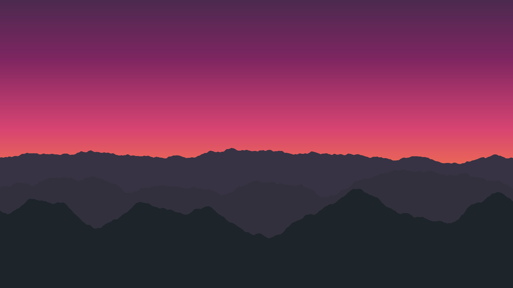

# programming a real image without integrating image 😂😂.

This Python script generates beautiful, stylized mountain landscapes at sunset using procedural generation techniques like Perlin noise.



## Features

-   Customizable image dimensions.
-   Multi-color, non-linear sky gradients.
-   Atmospheric sun glow effect.
-   Procedural starfield.
-   Layered, fractal mountain ranges with configurable detail.
-   Fast generation using NumPy vectorization.

## How to Use

1.  **Clone the repository:**
    ```bash
    git clone https://github.com/Aksharma127/something.git
    cd something
    ```

2.  **Install dependencies:**
    ```bash
    pip install -r requirements.txt
    ```

3.  **Run the script:**
    ```bash
    python landscape_generator.py
    ```
    A new image file named `landscape_[timestamp].png` will be created.

4.  **Customize (Optional):**
    -   You can change all parameters (colors, number of mountains, detail levels, etc.) by editing the `CONFIG` dictionary at the top of `landscape_generator.py`.
    -   You can also specify output dimensions from the command line:
        ```bash
        python landscape_generator.py --width 3840 --height 2160 --output my_4k_landscape.png
        ```
